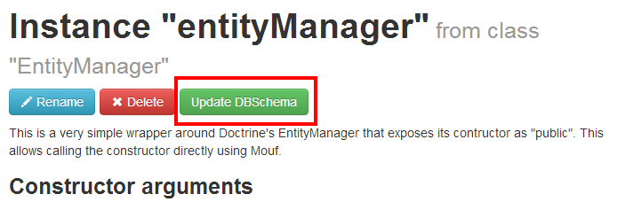
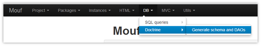

Doctrine ORM wrapper classes for Mouf
=====================================

This package contains a single class that makes Doctrine/ORM easily usable in Mouf.

It provides an installer that creates an instance of `EntityManager`.

The package also feature a special UI that will help you:

 * install & edit interfaces to help the user defining the main properties of the `entityManager` instance. 
 * automated DB Schema generation
 * DAO (repository) generation that produce helpers for performing base queries
 
These steps are triggered during the install process, but also when lanching the configuration interface from the `entityManager` instance dedicated button :

Finally, you will be able to update your DB Schema at all time using the menu entry in DB >> Doctrine >> Generate Schema and DAOs:

> **Approach:** Doctrine allows multiple strategies to operate from DB Schema to it's Entities.
In this package, we made the choice to work from Model down to DB Schema : you just define your entities,
then use the `entityManager` and associated `schemaTool` in order to create / update your schema.

For more information, please read the next steps:

 * Doctrine documentation is very important as this package is just a wrapper : [http://docs.doctrine-project.org/projects/doctrine-orm/en/latest/](http://docs.doctrine-project.org/projects/doctrine-orm/en/latest/)
 * [Defining properties for the `entityManager` instance](doc/define-properties.md)
 * [Create / Update your DB schema](doc/schema.md)
 * [Generated DAO classes](doc/daos.md)