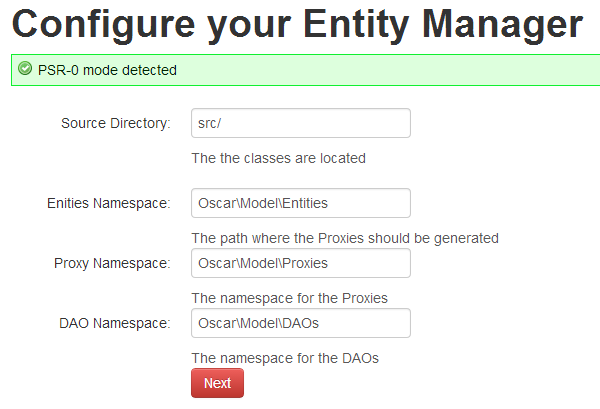

#Defining properties for the `entityManager` instance

This is the first step of the install / edition process of the Entity Manager. You may define:

 * The **source directory**: the directory here your classes are located, as defined in your composer.json file
 * **Entities Namespace:** the Namespace of your entities (Model Classes)
 * **Proxy Namespace:** the Namespace of the Proxies (mainly used for implementing Lazy loading)
 * **DAO Namespace:** the Namespace for you the DAOs (partly generated)
 
> **Note:** this package was built for PSR compliant projects. The DAO Namespace value will be used to generate DAO classes (see [Generated DAO classes](daos.md))

Next Step : [Schema Update](schema.md)