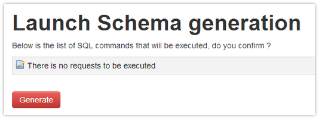

#Schema generation

As you may know, Doctrine allows you to generate your schema based on your entities. This is generaly done using by executing command lines in the console.

In this package, we have implemented this functionnality as both install and configuration tasks. The `entityManager` provides a "Generate Schema" button on instance view :


Once your have configured the main properties of the `entityManager`, your will be shown a message that lists all SQL requests that are about to be run on the Database. Here is an example of adding a field in the `User` entity:

This code has been added :
```php
	/**
	 * @Column(type="string")
	 * @var string
	 */
	public $myNewColumn = null;
```

This is the message that will be displayed :



When you click the "Generate" button, those requests will be triggered. In case anything went wrong, a backup of your DB structure is generated at the root of your project's directory, **BUT WARNING !! this dump does not include data for now, so be very carefull when generating your schema!**

When schema is generated, DAO classes are also written, please refer to this section for more information : [Generated DAO classes](daos.md)